<h1 align="center">Skill Icons</h1>

<p align="center">A simple SVG icon generator for programming languages and technologies.</p>

---

## 🤝 Help Needed!

This project needs your help! I'm looking for contributors to:

- Add more programming language icons
- Improve existing icons
- Add new technology icons
- Help with the API functionality
- Test and report bugs

##

<h1 align="center">Icons</h1>

## 🚀 How to Use

You can generate custom icon combinations using your own API! Here's an example:

**Example icons used above:**

<p align="center">

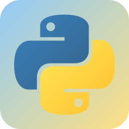

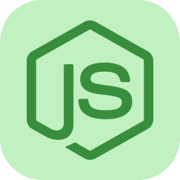

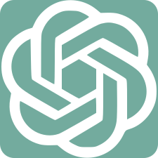

</p>

### 📝 API Parameters

**Icon Selection (`i=`):**

- Use the icon names from the list below
- Separate multiple icons with commas
- Example: `i=vite,npm,pnpm,docker,webpack,clerk`

**Icons Per Line (`perline=`):**

- Control how many icons appear in each row
- Default: 15, Maximum: 15
- Example: `perline=5` for 5 icons per line

**Theme (`t=`):**

- Change the theme of themed icons (if available)
- Default: `dark`
- Example: `t=light` for light theme
- Note: Only affects icons that have multiple theme versions

### 🔗 API URL Format

```
https://your-domain.vercel.app/api/icons?i=icon1,icon2,icon3&perline=number&t=theme
```

## 🚀 Deploy Your Own

To use this project, simply:

1. **Fork this repository** to your GitHub account
2. **Deploy to Vercel**:
   - Go to [vercel.com](https://vercel.com)
   - Connect your GitHub account
   - Import your forked repository
   - Deploy with default settings
3. **Replace the domain** in the URL format above with your Vercel domain
4. **All parameters remain the same**: `i=`, `perline=`, `t=` work exactly as shown

<p align="center">
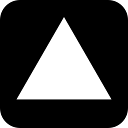 
</p>

**Vercel makes deployment super easy!**

Here's a list of all the icons currently supported. Feel free to open an issue to suggest icons to add!

|  #  |      Icon ID       |                         Icon                          |
| :-: | :----------------: | :---------------------------------------------------: |
|   1  |  `androidstudio`   |  |
|   2  |  `angular`         | 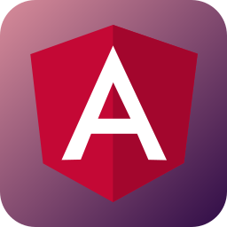 |
|   3  |  `antigravity`     |  |
|   4  |  `authjs`          |  |
|   5  |  `aws`             |  |
|   6  |  `chakraui`        |  |
|   7  |  `chatgpt`         |  |
|   8  |  `claude`          |  |
|   9  |  `clerk`           | 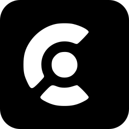 |
|  10  |  `cloudinary`      |  |
|  11  |  `codex`           |  |
|  12  |  `css`             |  |
|  13  |  `cursorai`        |  |
|  14  |  `deepseek`        |  |
|  15  |  `django`          |  |
|  16  |  `docker`          |  |
|  17  |  `drizzle`         |  |
|  18  |  `expo`            |  |
|  19  |  `express`         |  |
|  20  |  `figma`           | 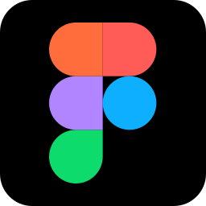 |
|  21  |  `framer`          |  |
|  22  |  `gemini`          |  |
|  23  |  `git`             |  |
|  24  |  `github`          |  |
|  25  |  `githubcopilot`   |  |
|  26  |  `gsap`            |  |
|  27  |  `heroui`          |  |
|  28  |  `html`            |  |
|  29  |  `inngest`         |  |
|  30  |  `jenkins`         |  |
|  31  |  `jest`            |  |
|  32  |  `js`              |  |
|  33  |  `jwt`             |  |
|  34  |  `k8s`             |  |
|  35  |  `kali`            |  |
|  36  |  `kubernetes`      |  |
|  37  |  `leetcode`        |  |
|  38  |  `linux`           |  |
|  39  |  `magicui`         |  |
|  40  |  `mantineui`       |  |
|  41  |  `materialui`      |  |
|  42  |  `mongo`           |  |
|  43  |  `mysql`           |  |
|  44  |  `nativewind`      |  |
|  45  |  `nestjs`          |  |
|  46  |  `netlify`         | 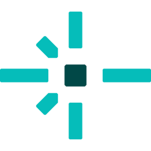 |
|  47  |  `nextjs`          | 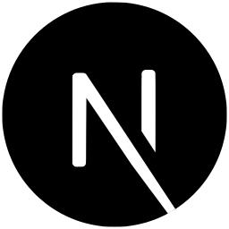 |
|  48  |  `node`            |  |
|  49  |  `npm`             | 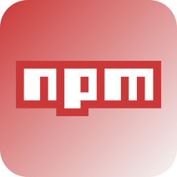 |
|  50  |  `nuxtjs`          |  |
|  51  |  `oauth`           |  |
|  52  |  `passportjs`      | 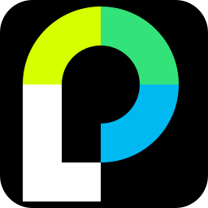 |
|  53  |  `pieces`          |  |
|  54  |  `pnpm`            |  |
|  55  |  `postgres`        |  |
|  56  |  `postman`         |  |
|  57  |  `prisma`          | 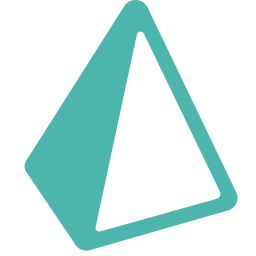 |
|  58  |  `prismic`         |  |
|  59  |  `py`              |  |
|  60  |  `react`           |  |
|  61  |  `reactnative`     |  |
|  62  |  `reactrouter`     | 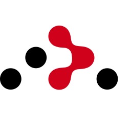 |
|  63  |  `redis`           |  |
|  64  |  `redux`           |  |
|  65  |  `sanity`          |  |
|  66  |  `shadcn`          | 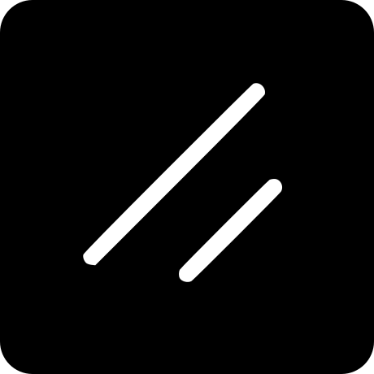 |
|  67  |  `skiperui`        | 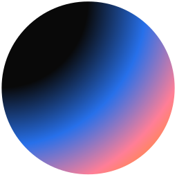 |
|  68  |  `socketio`        | 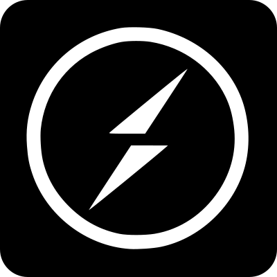 |
|  69  |  `stripe`          |  |
|  70  |  `tailwind`        |  |
|  71  |  `threejs`         | 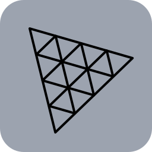 |
|  72  |  `tryhackme`       |  |
|  73  |  `ts`              |  |
|  74  |  `ubuntu`          |  |
|  75  |  `vercel`          |  |
|  76  |  `vite`            |  |
|  77  |  `vscode`          |  |
|  78  |  `webhooks`        |  |
|  79  |  `webpack`         | 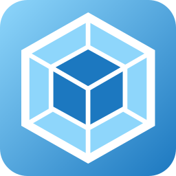 |
|  80  |  `windows`         |  |
|  81  |  `windsurf`        |  |
|  82  |  `zod`             |  |
|  83  |  `zustand`         |  |

---

<h1 align="center">⚠️ EXTREMELY DANGEROUS LICENSE ⚠️</h1>

<p align="center"><strong>Proceed only if you have a fire extinguisher, surge protector, and a will. 😈</strong></p>

## ☣️ TERMS OF MAYHEM

By using this repository, you agree that you may:

- 💥 **Detonate your productivity**
- 🔥 **Thermally challenge your CPU** (it will scream)
- 🧟 **Awaken ancient CLI spirits** with a single typo
- 🕵️ **Copy, fork, remix, and weaponize** this code (ethically, we hope)
- 🌀 **Summon infinite side-projects** you will never finish
- 📡 **Broadcast chaos** to unsuspecting teammates and CI pipelines

If any of the above happens, you agree it's hilarious and entirely your fault.

## 📜 THE ACTUAL LICENSE

```
MIT License - Do whatever you want!
But remember: With great power comes great responsibility...
and possibly a fried motherboard!
No warranty. No promises. No refunds. Batteries not included.
```

**Disclaimer**: No computers were actually harmed in the making of this project.
But we're not responsible if you try to run it on a potato! 🥔

---

**⭐ Star this repo if you survived reading this license! ⭐**


