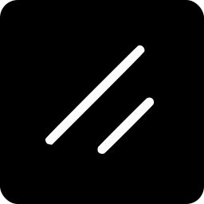

<h1 align="center">Skill Icons</h1>

<p align="center">A simple SVG icon generator for programming languages and technologies.</p>

---

## 🤝 Help Needed!

This project needs your help! I'm looking for contributors to:

- Add more programming language icons
- Improve existing icons
- Add new technology icons
- Help with the API functionality
- Test and report bugs

##

<h1 align="center">Icons</h1>

## 🚀 How to Use

You can generate custom icon combinations using our API! Here's an example:


### 📝 API Parameters

**Icon Selection (`i=`):**
- Use the icon names from the list below
- Separate multiple icons with commas
- Example: `i=vite,npm,pnpm,docker,webpack,clerk`

**Icons Per Line (`perline=`):**
- Control how many icons appear in each row
- Default: 15, Maximum: 15
- Example: `perline=5` for 5 icons per line

**Theme (`t=`):**
- Change the theme of themed icons (if available)
- Default: `dark`
- Example: `t=light` for light theme
- Note: Only affects icons that have multiple theme versions

### 🔗 API URL Format
```
https://skill-icons-snowy.vercel.app/api/icons?i=icon1,icon2,icon3&perline=number&t=theme
```

Here's a list of all the icons currently supported. Feel free to open an issue to suggest icons to add!

| # | Icon ID | Icon |
|:---:|:-------:|:----:|
| 1 | `angular` |  |
| 2 | `aws` |  |
| 3 | `chatgpt` |  |
| 4 | `clerk` |  |
| 5 | `cloudinary` |  |
| 6 | `css` |  |
| 7 | `cursorai` |  |
| 8 | `django` |  |
| 9 | `docker` |  |
| 10 | `express` |  |
| 11 | `figma` |  |
| 12 | `framer` |  |
| 13 | `git` |  |
| 14 | `github` |  |
| 15 | `html` |  |
| 16 | `jest` |  |
| 17 | `js` |  |
| 18 | `jwt` |  |
| 19 | `linux` |  |
| 20 | `magicui` |  |
| 21 | `materialui` |  |
| 22 | `mongo` |  |
| 23 | `mysql` |  |
| 24 | `netlify` |  |
| 25 | `nextjs` |  |
| 26 | `node` |  |
| 27 | `npm` |  |
| 28 | `oauth` |  |
| 29 | `passportjs` |  |
| 30 | `pieces` |  |
| 31 | `pnpm` |  |
| 32 | `postman` |  |
| 33 | `prismic` |  |
| 34 | `py` |  |
| 35 | `react` |  |
| 36 | `reactrouter` |  |
| 37 | `redis` |  |
| 38 | `redux` |  |
| 39 | `shadcn` |  |
| 40 | `socketio` |  |
| 41 | `tailwind` |  |
| 42 | `threejs` |  |
| 43 | `ts` |  |
| 44 | `ubuntu` |  |
| 45 | `vercel` |  |
| 46 | `vite` |  |
| 47 | `vscode` |  |
| 48 | `webhooks` |  |
| 49 | `webpack` |  |
| 50 | `windows` |  |

---

<h1 align="center">⚠️ EXTREMELY DANGEROUS LICENSE ⚠️</h1>

<p align="center"><strong>Proceed only if you have a fire extinguisher, surge protector, and a will. 😈</strong></p>

## ☣️ TERMS OF MAYHEM

By using this repository, you agree that you may:

- 💥 **Detonate your productivity**
- 🔥 **Thermally challenge your CPU** (it will scream)
- 🧟 **Awaken ancient CLI spirits** with a single typo
- 🕵️ **Copy, fork, remix, and weaponize** this code (ethically, we hope)
- 🌀 **Summon infinite side-projects** you will never finish
- 📡 **Broadcast chaos** to unsuspecting teammates and CI pipelines

If any of the above happens, you agree it's hilarious and entirely your fault.

## 📜 THE ACTUAL LICENSE

```
MIT License - Do whatever you want!
But remember: With great power comes great responsibility...
and possibly a fried motherboard! 
No warranty. No promises. No refunds. Batteries not included.
```

**Disclaimer**: No computers were actually harmed in the making of this project. 
But we're not responsible if you try to run it on a potato! 🥔

---

**⭐ Star this repo if you survived reading this license! ⭐**

